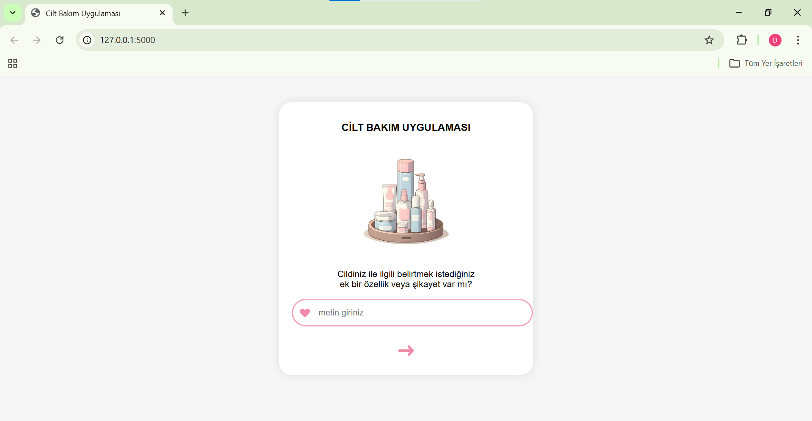

# NLP-Based Skin Type Classification Project

This project was developed as part of a **Natural Language Processing (NLP)** course.  
The aim of the project is to predict a user's skin type based on free-text descriptions using machine learning techniques.

The system allows users to enter a short text describing their skin condition and returns the predicted skin type through a web interface.

---

## Project Overview

- Dataset created manually using an online questionnaire
- Text preprocessing with NLTK
- Feature extraction using TF-IDF
- Class imbalance handled with SMOTE
- Machine learning models trained and evaluated
- Web application developed using Flask

---

## Skin Type Classes

The model classifies the input text into one of the following skin types:

- **Normal**
- **Dry (Kuru)**
- **Oily (Yağlı)**
- **Combination (Karma)**

---

## Dataset Description

The dataset was created manually using an online questionnaire.  
Participants were asked to describe their skin conditions freely in natural language.
The dataset contains 40 text samples distributed across four skin type classes.


The dataset consists of two columns:

- **text**: User-written description of skin condition  
- **label**: Skin type category

Example entries:

```
gün içinde bir parlama, Normal
sabun sonrası kuruluk oluyor, Normal
Soğuk havada cilt kuruması, Kuru
belirgin şikayet yağlanma olması, Yağlı
T bölgesinde yağlanma oluyor, Karma
```


Since the dataset is relatively small and imbalanced, **TF-IDF vectorization** and **SMOTE oversampling** were applied during preprocessing.

---

## Project Structure

```
NLP_SkinType_Project/
│
├── data/
│   ├── raw/
│   │   └── Skin_text_dataset.csv
│   └── processed/
│       └── anket_veri_smote_tfidf.csv
│
├── models/
│   ├── skin_model.pkl
│   └── tfidf.pkl
│
├── src/
│   ├── preprocessing/
│   │   └── veriSeti.py
│   └── training/
│       └── modelleme.py
│
├── web/
│   ├── app.py
│   ├── static/
│   │   ├── style.css
│   │   └── products.png
│   └── templates/
│       └── index.html
│
├── screenshots/
│   ├── home_page.png
│   └── prediction_result.png
│
├── requirements.txt
├── .gitignore
└── README.md
```

---

## Model Evaluation

Two machine learning models were trained and evaluated:

- Naive Bayes
- Logistic Regression

Model performance was evaluated using accuracy on a stratified train-test split.
Logistic Regression achieved better performance and was selected as the final model.

---

## How to Run the Project

### 1. Clone the repository
```bash
git clone https://github.com/your-username/NLP_SkinType_Project.git
cd NLP_SkinType_Project
```

### 2. Install required libraries
```
pip install -r requirements.txt
```

### 3. Run the Flask application
```
cd web
python app.py
```

### 4. Open in browser
Go to:
http://127.0.0.1:5000/

---

## Web Application Screenshots

### Home Page



### Prediction Result


